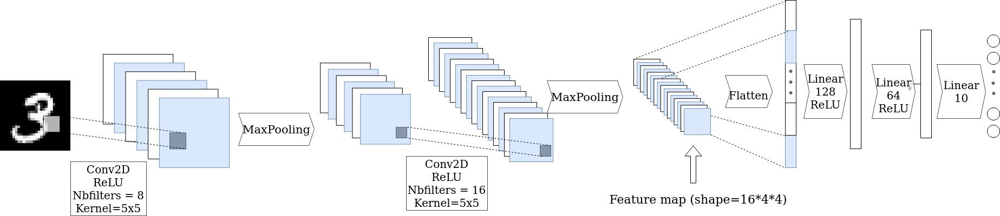
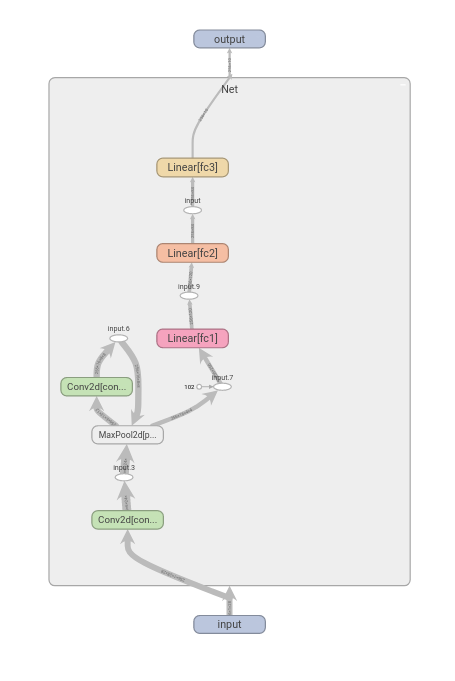
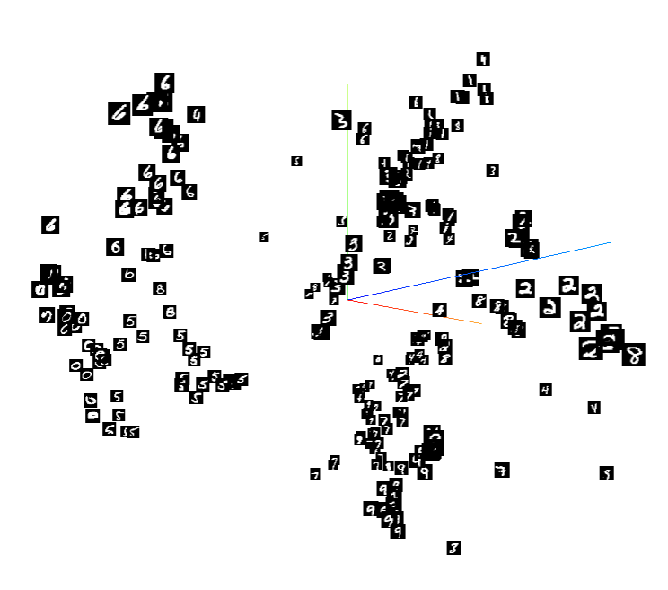

# Development for Data Scientist:
## Pytorch and Python Script
---------------------------------------------------
## Course
<iframe width="560" height="315" src="https://www.youtube.com/embed/RXmabok7Xpg" title="YouTube video player" frameborder="0" allow="accelerometer; autoplay; clipboard-write; encrypted-media; gyroscope; picture-in-picture" allowfullscreen></iframe>

<!-- *   [Slides](https://github.com/wikistat/AI-Frameworks/raw/master/slides/Code_Development_Python.pdf) -->
<!-- *   [Practical session](https://github.com/wikistat/AI-Frameworks/blob/master/CodeDevelopment/TP.pdf) -->

## Course notebook:
[Notebook](https://github.com/wikistat/AI-Frameworks/blob/master/Text/1_cleaning_vectorization.ipynb)  
[](https://colab.research.google.com/github/wikistat/AI-Frameworks/blob/website/code/developpement/intro_pytorch.ipynb)

## Practical session

For this session, you will have to write a script to train a small neural network on the MNIST dataset using Pytorch.  
During training, you will use tensorboard to:

- monitor your network across epochs
- manage your experiments and hyper-parameters  
- provide some vizualisations.

The solution is available here.  [](https://colab.research.google.com/github/wikistat/AI-Frameworks/blob/website/code/developpement/Development_for_Data_Scientist_solutions.ipynb)  
Try to complete the practical session without looking at it!

## The network class:

First create a file ``models.py`` that will contain our model's classe.  



Using the figure above, fill in the following code to create the network class:  

* The method ``__init__()`` should instantiate all the layers that the network will use.
* The method ``forward()`` describes the forward graph of your network. All the pooling operations and activation functions are realized in this method. Do not forget to change the shape of your input before the first linear layer using ``torch.flatten(...)`` or ``x.view(...)``.

```python
import torch
import torch.nn as nn
import torch.nn.functional as F

class MNISTNet(nn.Module):
    def __init__(self):
        super(Net, self).__init__()
        self.conv1 = nn.Conv2d(...)
        self.conv2 = nn.Conv2d(...)
        self.pool = nn.MaxPool2d(...)
        self.fc1 = nn.Linear(...)
        self.fc2 = nn.Linear(...)
        self.fc3 = nn.Linear(...)

    def forward(self, x):
        x = F.relu(self.conv1(x))       # First convolution followed by
        x = self.pool(x)                # a relu activation and a max pooling#
        x = ...
        ...
        x = self.fc3(x)
        return x
```
## The training script
You will now create a file ``train_mnist.py``.
This file will be used as a python script to train a neural network on the MNIST Dataset.  
Let's first create the ``train()`` and ``test()`` methods.

```python
import argparse
from statistics import mean

import torch
import torchvision
import torchvision.transforms as transforms
import torch.nn as nn
import torch.nn.functional as F
import torch.optim as optim
from tqdm import tqdm

from models import MNISTNet

 # setting device on GPU if available, else CPU
  device = torch.device('cuda' if torch.cuda.is_available() else 'cpu')

def train(net, optimizer, loader, epochs=10):
    criterion = nn.CrossEntropyLoss()
    for epoch in range(epochs):
        running_loss = []
        t = tqdm(loader)
        for x, y in t:
            x, y = x.to(device), y.to(device)
            outputs = net(x)
            loss = criterion(outputs, y)
            running_loss.append(loss.item())
            optimizer.zero_grad()
            loss.backward()
            optimizer.step()
            t.set_description(f'training loss: {mean(running_loss)}')

def test(model, dataloader):
    test_corrects = 0
    total = 0
    with torch.no_grad():
        for x, y in dataloader:
            x = x.to(device)
            y = y.to(device)
            y_hat = model(x).argmax(1)
            test_corrects += y_hat.eq(y).sum().item()
            total += y.size(0)
    return test_corrects / total
```
You will now implement the ``main`` method that will be called every time the python script is executed.  
First, add a parser to add three possible arguments provided when executing the script:

* The batch size
* The learning rate
* The number of training epochs

```python
if __name__=='__main__':

  parser = argparse.ArgumentParser()
  
  parser.add_argument(...)
  parser.add_argument(...)
  parser.add_argument(...)

  args = parser.parse_args()
  epochs = ...
  batch_size = ...
  lr = ...
```

he following code instantiates two [data loaders](https://pytorch.org/tutorials/beginner/basics/data_tutorial.html): one loading data from the training set, the other one from the test set.

```python
# transforms
  transform = transforms.Compose(
      [transforms.ToTensor(),
      transforms.Normalize((0.5,), (0.5,))])

  # datasets
  trainset = torchvision.datasets.MNIST('./data', download=True, train=True, transform=transform)
  testset = torchvision.datasets.MNIST('./data', download=True, train=False, transform=transform)

  # dataloaders
  trainloader = torch.utils.data.DataLoader(trainset, batch_size=batch_size, shuffle=True, num_workers=2)
  testloader = torch.utils.data.DataLoader(testset, batch_size=batch_size, shuffle=False, num_workers=2)
```

Instantiate a MNISTNet and a [SGD optimizer](https://pytorch.org/docs/stable/generated/torch.optim.SGD.html) using the learning rate provided in the script arguments.
Use the train method to train your network and the test method to compute the test accuracy. 

```python
  net = ...
  # setting net on device(GPU if available, else CPU)
  net = net.to(device)
  optimizer = optim.SGD(...)

  train(...)
  test_acc = test(...)
  print(f'Test accuracy:{test_acc}')
```

You should now be able to run your python script using the following command in your terminal:
```
python train_mnist.py --epochs=5 --lr=1e-3 --batch_size=64
```

## Monitoring and experiment management
Training our model on MNIST is pretty fast.
Nonetheless, in most cases, training a network may be very long.
For such cases, it is essential to log partial results during training to ensure that everything is behaving as expected.  
A very famous tool to monitor your experiments in deep learning is Tensorboard.  
The main object used by Tensorboard is a ``SummaryWriter``.  
Add the following import:
```python
from torch.utils.tensorboard import SummaryWriter
```
and modify the train method to take an additional argument named ``SummaryWriter`` and use its ``add_scalar`` method to log the training loss for every epoch.

```python
def train(net, optimizer, loader, writer, epochs=10):
    criterion = nn.CrossEntropyLoss()
    for epoch in range(epochs):
        running_loss = []
        t = tqdm(loader)
        for x, y in t:
            x, y = x.to(device), y.to(device)
            outputs = net(x)
            loss = criterion(outputs, y)
            running_loss.append(loss.item())
            optimizer.zero_grad()
            loss.backward()
            optimizer.step()
            t.set_description(f'training loss: {mean(running_loss)}')
        writer.add_scalar('training loss', mean(running_loss), epoch)
```
Instantiate a ``SummaryWriter`` with 
```python
writer = SummaryWriter(f'runs/MNIST')
```
 in your main and pass it as an argument to the ``train`` method.  
Re-run your scipt and check your tensorboard logs using in a separate terminal:
```
tensorboard --logdir runs
```

You can use tensorboard to log many different things such as your network computational graph, images, samples from your dataset, embeddings, or even use it for experiment management.
Add the following code to the end of your main function. 

```python
  #add embeddings to tensorboard
  perm = torch.randperm(len(trainset.data))
  images, labels = trainset.data[perm][:256], trainset.targets[perm][:256]
  images = images.unsqueeze(1).float().to(device)
  with torch.no_grad():
    embeddings = net.get_features(images)
    writer.add_embedding(embeddings,
                  metadata=labels,
                  label_img=images, global_step=1)
    
  # save networks computational graph in tensorboard
  writer.add_graph(net, images)
  # save a dataset sample in tensorboard
  img_grid = torchvision.utils.make_grid(images[:64])
  writer.add_image('mnist_images', img_grid)
```

You may have notice the `get_feature()` method in the code above.  
You have to add this method in the MNISTNet class:

```python
def get_features(self, x):
        x = self.pool(F.relu(self.conv1(x)))
        x = self.pool(F.relu(self.conv2(x)))
        x = x.view(-1, 16 * 4 * 4)
        return x
```

Re-run your script and restart tensorboard. 

Visualize the network computational graph by clicking on __Graph__.
You should see something similar to this:


Click on the __inactive__ button and choose __projector__ to look at the embeddings computed by your network





