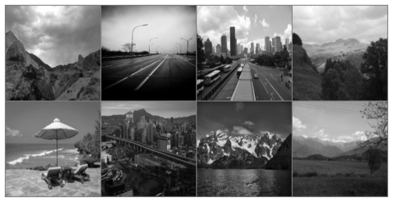
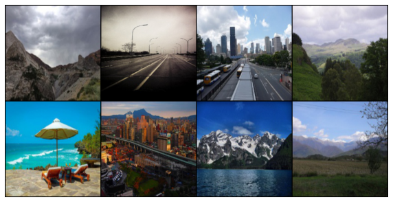
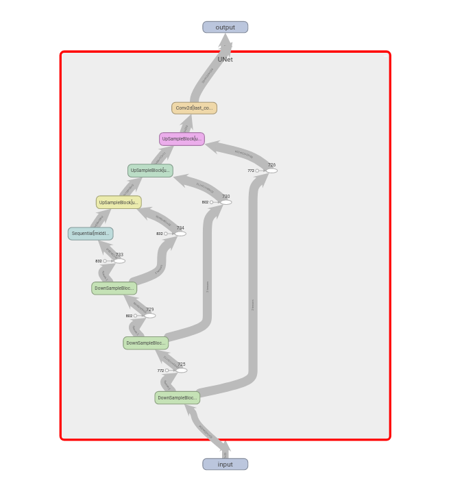
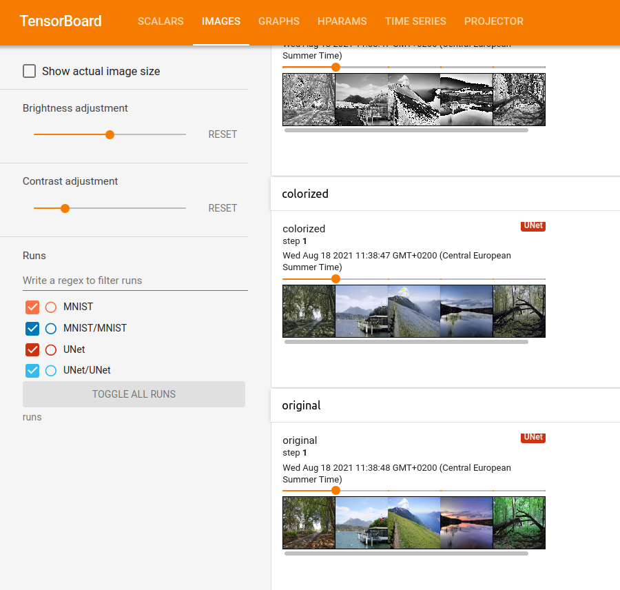

# Development for Data Scientist: 
## Introduction to Google Cloud Computing

## Course
<iframe width="560" height="315" src="https://www.youtube.com/embed/GzYbwCzJ2Bg" title="YouTube video player" frameborder="0" allow="accelerometer; autoplay; clipboard-write; encrypted-media; gyroscope; picture-in-picture" allowfullscreen></iframe>

*   [Slides](https://github.com/wikistat/AI-Frameworks/blob/master/CodeDevelopment/TP.pdf)
<!-- *   [Practical session](https://github.com/wikistat/AI-Frameworks/blob/master/CodeDevelopment/TP.pdf) -->

## Practical Session
In this session, you will train a neural network to colorize black and white images using virtual machines on [Google Cloud](https://cloud.google.com/).  
   

You will have to:

* Set up a new GCloud instance with GPU capacities
* Write your Python scripts on your local machine
* Send your code to your GCloud Instance
* Run your code on the cloud virtual machine 
* Monitor your code running on the virtual machine
* Get your results and send them to your local machine 

The solution is available here.  [](https://colab.research.google.com/github/wikistat/AI-Frameworks/blob/website/code/developpement/Development_for_Data_Scientist_solutions.ipynb)  
Try to complete the practical session without looking at it!

## Set up your virtual machine
First follow the GCloud setup process described [here](gcloud_set_up.md).

## The python script
Cloud providers charge by the hour, so cloud computing can quickly get expensive.
A good practice consists of doing most of the code development on your local hardware before sending it to your cloud instances.  
That is what you are going to do in this practical session.  
You will run one small iteration of your code on your local machine to test your code and then send it to your virtual machine.

We will be working with the [Landscapes dataset](https://github.com/ml5js/ml5-data-and-models/tree/master/datasets/images/landscapes) composed of 4000 images in seven categories of landscapes (city, road, mountain, lake, ocean, field, and forest).
Instead of using it to train a classifier, we will use it to train a neural network to colorize black and white images.

Create a script download_landscapes.sh with the following content and execute it to download and extract the dataset.
```
cd data
wget https://github.com/ml5js/ml5-data-and-models/raw/master/datasets/images/landscapes/landscapes_small.zip
mkdir landscapes
unzip landscapes_small.zip -d landscapes
rm landscapes_small.zip
rm -r landscapes/__MACOSX
cd ..
```

We will use a particular category of neural networks to perform the colorization operation: [Unets](https://arxiv.org/abs/1505.04597).
Initially designed for Biomedical Image Segmentation, Unets offer state-of-the-art performances in many segmentation tasks. These performances are mainly due to the skip connections used in UNets architectures.
Indeed, Unets are a particular form of Auto-Encoders using skip connections between corresponding layers of the encoder and the decoder.
  

Create a new file named `unet.py` where you will define the following Unet network:  


Help yourself with the above image to implement a Unet network using the following template:

```python
import torch
import torch.nn as nn
import torch.nn.functional as F

def double_conv(in_channels, out_channels):
    # returns a block compsed of two Convolution layers with ReLU activation function
    return nn.Sequential(
        nn.Conv2d(in_channels, out_channels, 3, padding=1),
        nn.ReLU(),
        nn.Conv2d(out_channels, out_channels, 3, padding=1),
        nn.ReLU()
    )   

class DownSampleBlock(nn.Module):

    def __init__(self, in_channels, out_channels):
        super().__init__()
        self.conv_block = ...
        self.maxpool = ...

    def forward(self, x):
        x_skip = ...
        out = ... 

        return out , x_skip

class UpSampleBlock(nn.Module):

    def __init__(self, in_channels, out_channels):
        super().__init__()
        self.conv_block = ...
        self.upsample = ... # use nn.Upsample

    def forward(self, x, x_skip):
        x = self.upsample(x)
        x = torch.cat([x, x_skip], dim=1) # concatenates x and x_skip
        x = self.conv_block(x)
        
        return x
    

class UNet(nn.Module):

    def __init__(self):
        super().__init__()
                
        self.downsample_block_1 = ...
        self.downsample_block_2 = ...
        self.downsample_block_3 = ...
        self.middle_conv_block = double_conv(128, 256)        

            
        self.upsample_block_3 = ...
        self.upsample_block_2 = ...
        self.upsample_block_1 = ...
        
        self.last_conv = nn.Conv2d(32, 3, 1)
        
        
    def forward(self, x):
        x, x_skip1 = ...
        x, x_skip2 = ...
        x, x_skip3 = ... 
        
        x = self.middle_conv_block(x)
        
        x = #use upsampleblock_3 and x_skip3
        x = #use upsampleblock_2 and x_skip2
        x = #use upsampleblock_1 and x_skip1       
        
        out = self.(x)
        
        return out

        
if __name__=='__main__':
    x = torch.rand(16,1,224,224)
    net = UNet()
    y = net(x)
    assert y.shape == (16,3,224,224)
    print('Shapes OK')

```

Check that your network is producing correct outputs by running your file with:
```
python unet.py
```
The

## Training script
You will now implement the training procedure.  

Training a network to colorize images is a supervised regression problem. 
Consider $x$ a grayscaled image and $y$ its corresponding colored image.
Training a parametrized network $f_\theta$ to predict colorized images $ŷ$ amounts to minimizing the distance between the prediction $ŷ$ and the actual $y$.  
That is to say minimizing $MSE(y, f_\theta(x))$.

Create a new file `data_utils.py` that will handle the dataset:
```python
from torchvision.datasets.folder import ImageFolder, default_loader, IMG_EXTENSIONS 
from torch.utils.data import DataLoader
import torchvision.transforms as transforms

class ImageFolderGrayColor(ImageFolder):
    
    def __init__(
            self,
            root,
            transform=None,
            target_transform=None,
    ):
        super(ImageFolder, self).__init__(root=root,
                                          loader=default_loader,
                                          transform=transform,
                                          extensions=IMG_EXTENSIONS,
                                          target_transform=target_transform)

    #TODO à modifier
    def __getitem__(self, index):
            """
            Args:
                index (int): Index

            Returns:
                tuple: (sample, target) where target is class_index of the target class.
            """
            path, _ = self.samples[index]
            sample = self.loader(path)
            if self.target_transform is not None:
                target = self.target_transform(sample)
            if self.transform is not None:
                sample = self.transform(sample)
            return sample, target


def get_colorized_dataset_loader(path, **kwargs):
    source_process = transforms.Compose(
        [transforms.Resize((224, 224)), transforms.Grayscale(num_output_channels=1), transforms.ToTensor(),
         transforms.Normalize(mean=[0.5], std=[0.5])])
    target_process = transforms.Compose(
        [transforms.Resize((224, 224)), transforms.ToTensor()])
    dataset = ImageFolderGrayColor(path, source_process, target_process)
    return DataLoader(dataset, **kwargs)
```

Create a new file `colorize.py` and fill the ```train``` method in the following canvas (you can inspire yourself from the one in the MNIST example. Be careful, however, in your criterion choice):  

```python
import argparse # to parse script arguments
from statistics import mean # to compute the mean of a list
from tqdm import tqdm #used to generate progress bar during training

import torch
import torch.optim as optim 
from torch.utils.tensorboard import SummaryWriter
from  torchvision.utils import make_grid #to generate image grids, will be used in tensorboard 

from data_utils import get_colorized_dataset_loader # dataloarder
from unet import UNet

# setting device on GPU if available, else CPU
device = torch.device('cuda' if torch.cuda.is_available() else 'cpu')

def train(net, optimizer, loader, epochs=5, writer=None):
    criterion = ...
    for epoch in range(epochs):
        running_loss = []
        t = tqdm(loader)
        for x, y in t: # x: black and white image, y: colored image 
            ...
            ...
            ...
            ...
            ...
            ...
            ...
            ...
        if writer is not None:
            #Logging loss in tensorboard
            writer.add_scalar('training loss', mean(running_loss), epoch)
            # Logging a sample of inputs in tensorboard
            input_grid = make_grid(x[:16].detach().cpu())
            writer.add_image('Input', input_grid, epoch)
            # Logging a sample of predicted outputs in tensorboard
            colorized_grid = make_grid(outputs[:16].detach().cpu())
            writer.add_image('Predicted', colorized_grid, epoch)
            # Logging a sample of ground truth in tensorboard
            original_grid = make_grid(y[:16].detach().cpu())
            writer.add_image('Ground truth', original_grid, epoch)
    return mean(running_loss)
        


if __name__=='__main__':
    parser = argparse.ArgumentParser()
    parser.add_argument('--data_path', type=str, default = 'data/landscapes', help='dataset path')
    parser.add_argument('--batch_size', type=int, default = int(32), help='batch_size')
    parser.add_argument('--epochs', type=int, default = int(10), help='number of epochs')
    parser.add_argument('--lr', type=float, default = float(1e-3), help='learning rate')

    args = parser.parse_args()
    data_path = args.data_path
    batch_size = args.batch_size
    epochs = args.epochs
    lr = args.lr
    unet = UNet().cuda()
    loader = get_colorized_dataset_loader(path=data_path, 
                                        batch_size=batch_size, 
                                        shuffle=True, 
                                        num_workers=4)


    optimizer = optim.Adam(unet.parameters(), lr=lr)
    writer = SummaryWriter('runs/UNet')
    train(unet, optimizer, loader, epochs=epochs, writer=writer)
    writer.add_graph(unet)

    # Save model weights
    torch.save(unet.state_dict(), 'unet.pth')
```

## Training on GCloud
You now have everything to run your code on GCloud.  
Fire up your GCloud instance.
On a terminal, connect to your instance using the following command (replace the zone and instance name with yours):
```
gcloud compute ssh --zone "europe-west1-d" "your_instance_name"
```

Create a folder `Workspace` on your virtual machine:
```
mkdir Workspace
```

You can copy a file from your local machine to the virtual machine using the following command on your local terminal:
```
gcloud compute scp [your_file_path] your_instance_name:Workspace/ --zone "europe-west1-d"
```
Conversly, you can copy a from your virtual machine to your local machine the following command on your local terminal:
```
gcloud compute scp bsf.pth your_instance_name:Workspace/ --zone "europe-west1-d"
```

Add the `--recurse` argument to your command if you want to copy a folder.

Copy the folder containing all your code into your virtual machine's Workspace folder.
Also, copy the `download_landscapes.sh` file into your VM and execute it.

You should now be able to run your python script and thus learn to colorize images.
Run your script for one entire epoch to check that everything is working fine.

We will now run our script for a few more epochs, but before that, we will create an ssh tunnel between our local machine and the virtual machine.  
Run the following command on your local machine with the correct name for your virtual machine (use your correct zone).
```
gcloud compute  ssh --ssh-flag="-L 8898:localhost:8898"  --zone "us-central1-b" "example_instance_name"
```
This command connects you to your virtual machine and forwards its port 8898 to your local machine's port 8898 (you can change the port value if needed).
Thanks to that, you will get access to the tensorboard interface running on the virtual machine through your local machine.

Now on this terminal window, run the following command:
```
tensorboard --logdir runs --port 8898
```

On another terminal, connect to your virtual machine and run your script with a few more epochs (like 10 for instance).

On your web browser, go to the following adress: http://localhost:8898/

You should be able to access tensorboard.  
Check on your network graph. You should see the U shape of your Unet.


You can now visualize the progression of your network while it is training in the images tab.


### Bonus synchronize with Rsync
An easy way to synchronize your code with your VM is to use rsync

Install rsync __on your virtual machine__:
```
sudo apt-get install rsync
```
Add the public key you’re going to use to connect to the VM  to the VM’s ~/.ssh/authorized_keys

On the virtual machine:
```
touch ~/.ssh/authorized_keys
nano ~/.ssh/authorized_keys
```

Copy the content of your public key (It is usually located in ~/.ssh/id_rsa.pub on your local machine) in the opened file.
Press `ctrl+x` then `y` then `enter` to save.

Now to synchronize a folder, find the IP of your virtual machine in the GCloud interface:


To synchronize your folder on your local machine (for instance, named `test_gcloud`) with a distant folder on the virtual machine (located, for example, in Workspace/test_gcloud):

```
rsync -r  [VM_IP_ADRESS]:Workspace/test_gcloud/ test_gcloud/
```

To synchronize a distant folder on the virtual machine with a folder on your local machine :

```
rsync -r  test_gcloud/ [VM_IP_ADRESS]:Workspace/test_gcloud/ 
```
You can find more information on the rsync command [here (in french)](https://doc.ubuntu-fr.org/rsync)

You can stop your VM using the GCloud interface or just by running the following command:
```
sudo shutdown -h now
```
