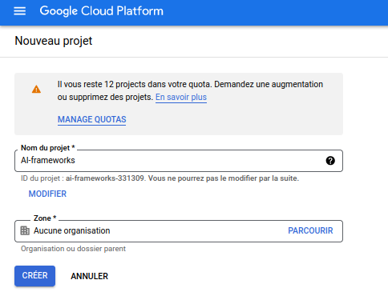
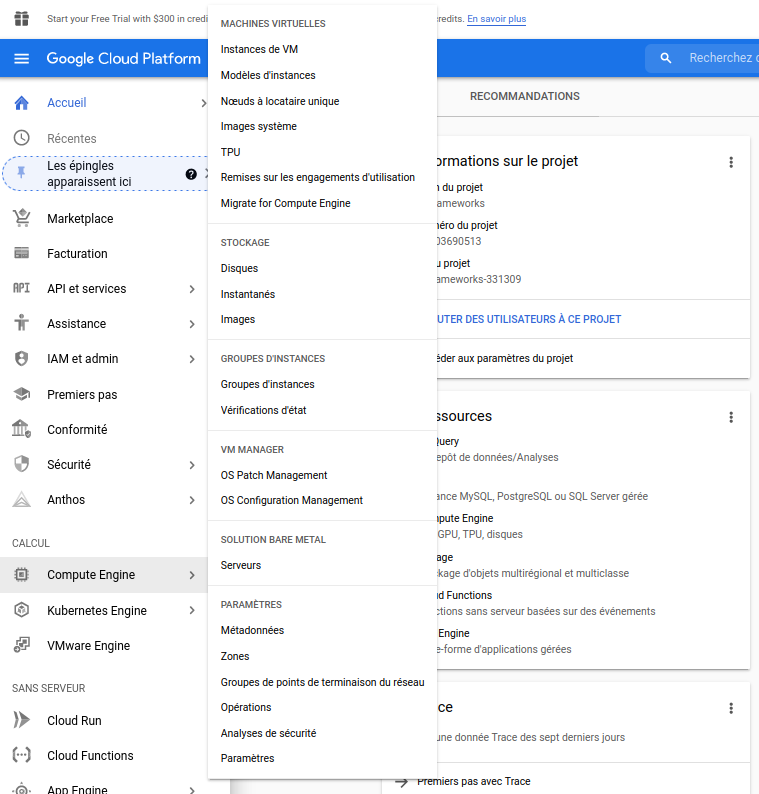
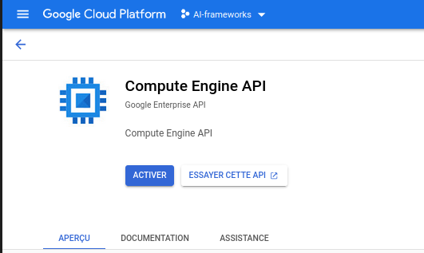
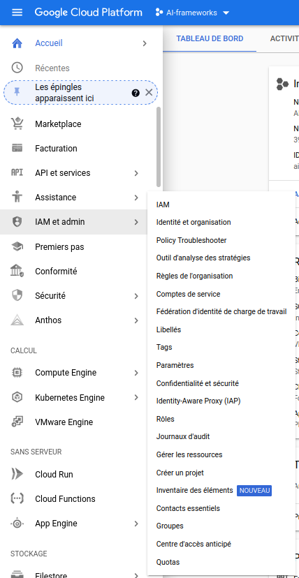
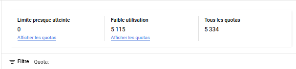
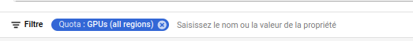
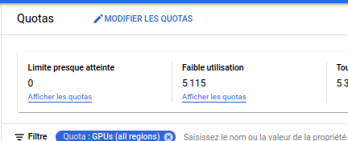
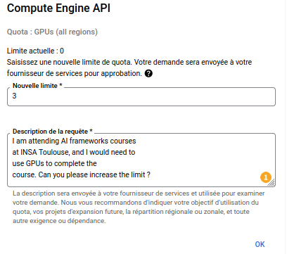

# Set up GCloud: 
Google sponsors this course with free GCloud credits through the Cloud Higher Education Programs.

Go to [this link](https://gcp.secure.force.com/GCPEDU?cid=HGfyYSrJnwOmvOkly5FUWbeGvTTyaYsuzI%2BUJ3owt3WKC%2BSJW%2BoIZzdGozvQAzWe/) to claim your coupon code for the credits associated with this course.  
Once you have your coupon code go to [this link](https://console.cloud.google.com/education?authuser=4) to get your credits (you will need a Google account, if needed, you can create one using your INSA mail address).
Once you are on the GCloud homepage, start by creating a new project:  

  
Once your project is created go to Compute Engine -> VM instances
 and activate Compute Engine API for your project .  
You now need to add GPU capacity to your project.  
Go to IAM and admin -> Quotas  
.  
On the filter select Quota  and GPUs(all regions)  and click on modify quotas .  
Increase the limit to at least one and add a short description to your request.  
This process may take some time. Therefore, be sure sure to complete every step at least a few days before the practical session.

You will also need to install the Cloud SDK Command-line interface.
It should already be installed on the INSA's machines.
If you are using your personal computer, follow the corresponding installation procedure available [here](https://cloud.google.com/sdk/docs/install).

