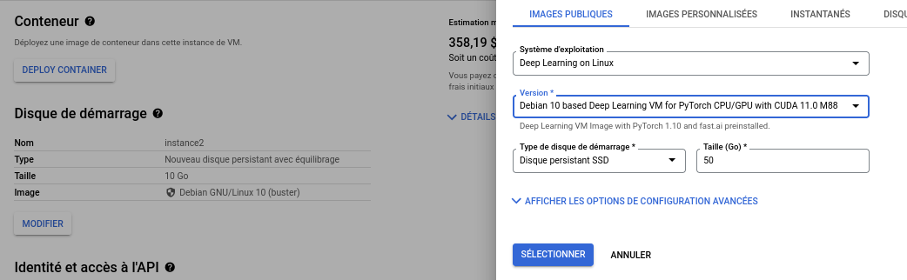

# Set up GCloud: 
Google sponsors this course with free GCloud credits through the Cloud Higher Education Programs.

Go to [this link](https://gcp.secure.force.com/GCPEDU?cid=RBFJpKAz0LRJ493ePedMXSBhdpFDdZGnAgAWbn6eDHi1V%2FuYWvVAOwEUlFuSGB8J/) to claim your coupon code for the credits associated with this course.  
Once you have your coupon code go to [this link](https://console.cloud.google.com/education?authuser=4) to get your credits (you will need a Google account, if needed, you can create one using your INSA mail address).  
Once you are on the GCloud homepage, start by creating a new project:  


  
Once your project is created go to Compute Engine -> VM instances
  
and activate Compute Engine API for your project .  
You now need to add GPU capacity to your project.  
Go to IAM and admin -> Quotas  
.  
On the filter type the following ```Quota:GPUs (all regions)```  
   
  
select the resulting service and click on modify quotas  
.  
Increase the limit to one and add a short description to your request:

*Hi,*
*I am a student enrolled at INSA Toulouse.
The GCloud Higher education program granted us free credits.
These credits are associated with a course in which the practical sessions will require access to GPU machines.
Would you please increase my GPU quota so I can participate to the practical sessions?*

*Many thanks,*

*You name*

   
This process may take some time. Therefore, be sure sure to complete every steps at least a few days before the practical session.

You will also need to install the Cloud SDK Command-line interface.  
It should already be installed on the INSA's machines.  
If you are using your personal computer, follow the corresponding installation procedure available [here](https://cloud.google.com/sdk/docs/install).

Once the GCloud SDK is configured on your local machine, go to your GCloud interface and go to Compute engine ->VM instances  
  

Click on the create new instance button  to create your first instance.  
Be sure at this point that your quota request has been approved or you will not be able to attach a GPU to your Virtual Machine.  
Now create a new instance on the same region you asked for your GPU quota.
You may follow the following parameters settings for the practical session. (click on plate-forme du CPU et GPU and add a K80 GPU)
  
Select the following hard drive options  
  
Finally, check the two checkboxes at the bottom of the page to allow Http/Https traffic.
  
After a few minutes your instance should be created.
It should appear in the VM instance panel:
  
If its status is in green, the virtual machine is started and is now consuming your free credit.  
Go to ssh -> show ssh the gcloud command and copy the command on your terminal (you may need to run the ```gcloud init``` command before if it does not work at first).    
You should now be connected to your virtual machine and see the following output on your terminal:
  
Type 'y' to install the nvidia drivers.
If the drivers failed to be installed and you obtain the following message:

Wait a few minutes and type:
```console
cd /opt/deeplearning/
sudo ./install-driver.sh 
```
To verify that everything is correctly installed type the following command
```console
nvidia-smi
```
If you see something like 
```
+-----------------------------------------------------------------------------+
| NVIDIA-SMI 460.73.01    Driver Version: 460.73.01    CUDA Version: 11.2     |
|-------------------------------+----------------------+----------------------+
| GPU  Name        Persistence-M| Bus-Id        Disp.A | Volatile Uncorr. ECC |
| Fan  Temp  Perf  Pwr:Usage/Cap|         Memory-Usage | GPU-Util  Compute M. |
|                               |                      |               MIG M. |
|===============================+======================+======================|
|   0  Tesla K80           Off  | 00000000:00:04.0 Off |                    0 |
| N/A   36C    P0    69W / 149W |      0MiB / 11441MiB |    100%      Default |
|                               |                      |                  N/A |
+-------------------------------+----------------------+----------------------+
                                                                               
+-----------------------------------------------------------------------------+
| Processes:                                                                  |
|  GPU   GI   CI        PID   Type   Process name                  GPU Memory |
|        ID   ID                                                   Usage      |
|=============================================================================|
|  No running processes found                                                 |
+-----------------------------------------------------------------------------+
```  
then your installation is almost complete.  
Run the following commands to install the libraries needed for the practical session:
```
pip3 install torch torchvision --extra-index-url https://download.pytorch.org/whl/cu113
pip install tqdm gradio tensorboard
```  
 Everything should be OK now.
 You can stop your virtual machine until the practical session using the GCloud web interface or typing the following command:

```console
sudo shutdown -h now
```

Be sur to do all this process before the practical session, it will save you many time and remember at least to ask for your quotas as soon as possible!